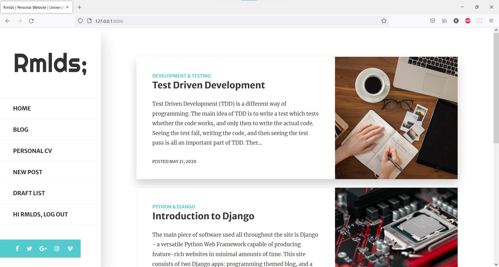

# Personal Website Developed using Python & Django. Built using Test Driven Development with Selenium

## Description
This project is a personal website developed using Python & Django. It includes a programming themed
blog and a personal CV. It is built using Test Driven Development powered by Selenium.

## Screenshots
The personal blog contains all the blog posts.

The personal CV contains a personal introduction, as well as sections for skills, education,
achievements, courses. Elements within these sections can be added, modified, and deleted.

## Running
In order to run the project, clone the repository using `git clone` and follow the below steps.

1. Create a Python virtual environment using `python -m venv some-env`
2. Install Django `python -m pip install Django` and verify using `python -m django --version`
3. Run the website using `python manage.py runserver`
